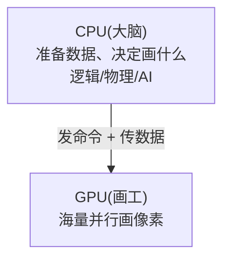
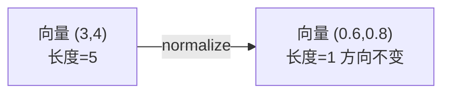

# 第0章 渲染管线与数学基础

> 在写第一行 Shader 之前，你得先知道：**GPU 到底在干什么？我写的代码运行在哪一步？**
> 这一章不写代码，但它是地基。地基不稳，后面学得越多越糊涂。

---

## 一、学习目标

- 理解一帧画面是怎么从「数据」变成「屏幕像素」的（渲染管线）
- 知道顶点着色器 / 片元着色器分别在哪一步、各自管什么
- 搞懂 CPU 和 GPU 的分工，以及 Draw Call 为什么影响性能
- 复习写 Shader 必备的数学：向量、点乘、归一化、坐标空间、MVP

---

## 二、说人话：GPU 是一条「工厂流水线」

想象你要把一堆零件（3D 模型数据）加工成一张成品照片（屏幕画面）。GPU 就是一条高度并行的流水线：


用一句话记住这两个最重要的环节：

- **顶点着色器（VS）**：管「形状」。输入一个顶点，输出它在屏幕上的位置。**有多少个顶点就跑多少次。**
- **片元着色器（FS）**：管「颜色」。输入一个像素，输出它的 RGBA 颜色。**有多少个像素就跑多少次（通常是大头）。**

> 关键直觉：VS 和 FS 都是**并行**跑的。GPU 同时有成千上万个核心在处理不同的顶点 / 像素。所以 Shader 里**不能写「我和隔壁像素商量一下」这种逻辑**——每个像素都是独立计算的。

### 一个生活类比

- 顶点着色器像「定好画框的四个角钉在墙上哪里」。
- 光栅化像「在画框范围内铺满一格格的小方块」。
- 片元着色器像「给每个小方块涂上颜色」。

---

## 三、CPU 与 GPU 的分工，以及 Draw Call



- **CPU**：擅长复杂逻辑、串行任务（游戏逻辑、物理）。
- **GPU**：擅长「同一件事重复做亿万遍」（给每个像素算颜色）。

**Draw Call** = CPU 对 GPU 喊一次「来，把这批东西画了」。

- 每次 Draw Call 都有沟通成本（CPU 要打包参数、切换状态）。
- Draw Call 太多，瓶颈会卡在 CPU 通知 GPU 上，而不是 GPU 算不过来。
- 所以优化常说「合批（合并 Draw Call）」。这也是为什么换材质 / 换贴图会打断合批——因为换了就得重新喊一次。

> 对学 Shader 的意义：你写的 effect 会影响能不能合批。后面会提到。

---

## 四、写 Shader 必备的数学（够用版，不吓人）

别怕，Shader 用到的数学都是**几何直觉**，不是做证明题。

### 4.1 向量（vector）

一个向量就是一组数，比如 `vec3(x, y, z)`。它有两种用途，**全靠语境区分**：

- 当「**位置（点）**」：表示空间里的一个坐标，如顶点位置 `(1, 2, 3)`。
- 当「**方向**」：表示一个朝向，如法线、光照方向。

颜色在 Shader 里也是向量！`vec4(r, g, b, a)`，每个分量一般 0~1：

- `vec4(1,0,0,1)` = 红色
- `vec4(1,1,1,1)` = 白色
- `vec4(0,0,0,1)` = 黑色

### 4.2 归一化（normalize）

把一个方向向量「变成长度为 1、但方向不变」。

- 为什么要做？因为光照计算里我们只关心**方向**，不关心长度。统一成长度 1 才好比较。
- 代码：`normalize(v)`



### 4.3 点乘（dot product）—— Shader 里最常用的运算

`dot(a, b)` 返回一个**数字**。当 a、b 都是**单位向量**时，点乘 = 两个向量夹角的余弦值 `cos(θ)`：

| 两向量关系 | 点乘结果 | 几何含义 |
| --- | --- | --- |
| 方向相同 | 1 | 完全对着 |
| 互相垂直 | 0 | 90 度 |
| 方向相反 | -1 | 背对 |

**这就是光照的核心**：面朝光（点乘大）就亮，背对光（点乘小 / 负）就暗。

```glsl
// 漫反射的本质就这一行：法线 N 和光方向 L 的点乘
float brightness = max(dot(N, L), 0.0); // 背光时夹住为 0，不出现负数
```

### 4.4 叉乘（cross product）

`cross(a, b)` 返回一个**向量**，方向同时垂直于 a 和 b。常用于求一个平面的法线方向。入门阶段知道有这个就行。

### 4.5 坐标空间与 MVP 矩阵（重点）

一个顶点从「模型自己的坐标」到「屏幕上的位置」，要经历几次「换坐标系」。每次换都是乘一个矩阵：


- **M（Model）模型矩阵**：把模型从「自己的小世界」摆到「大世界」的某个位置 / 旋转 / 缩放。
- **V（View）视图矩阵**：把世界「转」到相机视角下（相当于移动整个世界让相机回到原点）。
- **P（Projection）投影矩阵**：制造「近大远小」的透视效果，把 3D 压成可显示的范围。

顶点着色器里最经典的一行就是：

```glsl
// 把模型空间的顶点位置，一路变换到裁剪空间
gl_Position = MVP * vec4(position, 1.0);
```

> 好消息：在 Cocos 里这些矩阵都是引擎**自动算好、通过内置变量传给你**的，你直接用就行（第2章会讲怎么拿）。你只需要理解「为什么要乘它」。

为什么位置要写成 `vec4(position, 1.0)` 而不是 `vec3`？因为矩阵变换需要第4个分量（齐次坐标），位置点用 1.0、纯方向用 0.0。入门记住这个规则即可。

---

## 五、常见坑

1. **以为 Shader 能像普通程序一样 print 调试**：不行。GPU 上没有 console。调试靠「把数值输出成颜色看」（第7章细讲）。
2. **以为像素之间能互相访问**：不行。每个片元独立计算。
3. **方向向量忘了 normalize**：点乘结果就不再是 cos，光照会错。
4. **把颜色当成 0~255**：Shader 里颜色是 0~1 的浮点数，不是 0~255。

---

## 六、练习题（动脑，不用写代码）

1. 一个屏幕上铺满的全屏画面是 1920×1080，片元着色器大约要跑多少次？顶点着色器（假设就一个铺满屏的矩形 = 2个三角形 = 6个顶点）跑多少次？体会两者数量级差异。
2. 已知法线 `N=(0,1,0)`（朝上），光方向 `L=(0,1,0)`（也朝上）。`dot(N,L)` 是多少？这个面是亮还是暗？如果光改成 `L=(0,-1,0)` 呢？
3. 用自己的话解释：为什么换材质会打断合批、增加 Draw Call？
4. 思考：如果不做投影变换（P 矩阵），3D 画面会失去什么效果？

---

掌握了「GPU 在干嘛 + 基础数学」，下一章我们就来学 Shader 的编程语言：[第1章 GLSL 语言入门](./01-GLSL语言入门.md)。
