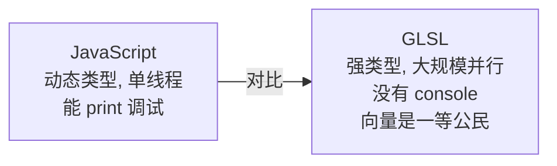
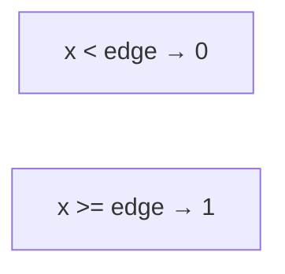
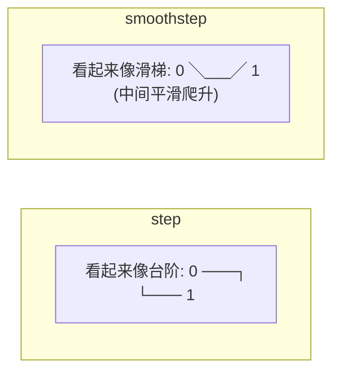
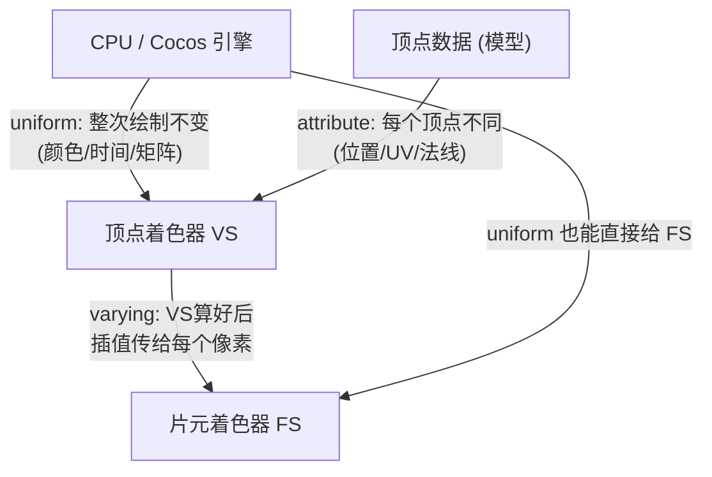

# 第1章 GLSL 语言入门

> GLSL 是写 Shader 用的编程语言。它长得很像 C，如果你写过 TS/JS，会觉得既熟悉又有点怪。
> 这一章带你把「能读懂 Shader 代码」这关过了。

---

## 一、学习目标

- 认识 GLSL 的数据类型（重点是 `vec`）
- 掌握 swizzle（`.xyz` / `.rgb` 这种花式取值）
- 记住几个高频内置函数：`mix` / `step` / `smoothstep` / `clamp` / `dot` / `fract`
- 理解 `attribute` / `varying` / `uniform` 三种数据来源
- 知道精度限定符和分支的性能注意点

---

## 二、说人话：GLSL 和 JS 的最大区别



三个心态转变：

1. **类型很严格**：`float a = 1;` 报错！必须写 `float a = 1.0;`（整数和浮点不能混）。
2. **向量是亲儿子**：加减乘除可以直接对 `vec` 整体操作，还能花式取分量。
3. **没有循环遍历像素**：你只写「单个像素怎么算」，GPU 自动帮你跑遍所有像素。

---

## 三、数据类型

| 类型 | 含义 | 例子 |
| --- | --- | --- |
| `float` | 浮点数 | `float t = 0.5;` |
| `int` | 整数 | `int n = 3;` |
| `bool` | 布尔 | `bool b = true;` |
| `vec2` | 2维向量 | `vec2 uv = vec2(0.5, 0.5);` |
| `vec3` | 3维向量 | `vec3 color = vec3(1.0, 0.0, 0.0);` |
| `vec4` | 4维向量 | `vec4 c = vec4(1.0, 0.0, 0.0, 1.0);` |
| `mat3` / `mat4` | 3x3 / 4x4 矩阵 | 坐标变换用 |
| `sampler2D` | 一张 2D 贴图 | 采样纹理用 |

构造向量的几种写法（很灵活）：

```glsl
vec3 a = vec3(1.0, 2.0, 3.0);   // 逐个给
vec3 b = vec3(1.0);             // 三个分量都是 1.0 → (1,1,1)
vec4 c = vec4(a, 1.0);          // 用 vec3 拼一个分量 → (1,2,3,1)
vec4 white = vec4(vec3(1.0), 1.0); // 常见：rgb 全 1，alpha 1
```

> 浮点写法铁律：**永远带小数点**。`1` 是 int，`1.0` 才是 float。混用是新手最常见的编译报错。

---

## 四、Swizzle：花式取分量（GLSL 最爽的特性）

向量的分量可以用 `xyzw`（位置）或 `rgba`（颜色）或 `stpq`（纹理）来访问，而且能**任意组合、重排、重复**：

```glsl
vec4 c = vec4(0.1, 0.2, 0.3, 0.4);

float r = c.r;        // 0.1（等价于 c.x）
vec2 xy = c.xy;       // (0.1, 0.2)
vec3 rgb = c.rgb;     // (0.1, 0.2, 0.3)
vec3 bgr = c.bgr;     // (0.3, 0.2, 0.1) ← 重排！
vec3 rrr = c.rrr;     // (0.1, 0.1, 0.1) ← 重复！常用于灰度
c.a = 1.0;            // 也能赋值
```

> `xyzw` 和 `rgba` 只是同一份数据的不同叫法，挑语义合适的用：处理坐标用 `xyz`，处理颜色用 `rgb`。

---

## 五、高频内置函数（务必背下来）

这几个函数是 Shader 里出现频率最高的，理解它们的「函数图像」比死记更重要。

### 5.1 `clamp(x, min, max)` —— 夹住范围

把 x 限制在 [min, max] 之间。超出就取边界值。

```glsl
clamp(1.5, 0.0, 1.0); // → 1.0
clamp(-0.3, 0.0, 1.0); // → 0.0
```

### 5.2 `mix(a, b, t)` —— 线性混合（插值）

按比例 t（0~1）在 a 和 b 之间过渡。**做渐变、过渡色全靠它**。

- `t=0` → 返回 a
- `t=1` → 返回 b
- `t=0.5` → 返回 a、b 中间值

```glsl
vec3 red = vec3(1.0, 0.0, 0.0);
vec3 blue = vec3(0.0, 0.0, 1.0);
vec3 c = mix(red, blue, 0.5); // 紫色 (0.5, 0, 0.5)
```

### 5.3 `step(edge, x)` —— 硬切开关



返回 0 或 1，没有过渡。**做硬边界、二值化**用。

```glsl
step(0.5, 0.3); // → 0.0
step(0.5, 0.8); // → 1.0
```

### 5.4 `smoothstep(e0, e1, x)` —— 平滑过渡

和 step 类似，但在 e0 到 e1 之间是**平滑的 S 形过渡**，不是硬切。**做柔和边缘、抗锯齿**用。

```glsl
smoothstep(0.4, 0.6, 0.5); // → 0.5（在过渡区中间）
```

step 和 smoothstep 的图像对比（横轴 x，纵轴输出）：



### 5.5 `fract(x)` —— 取小数部分

```glsl
fract(3.7); // → 0.7
fract(5.2); // → 0.2
```

常用于**循环 / 重复**效果（比如让 UV 不断循环），配合时间做动画。

### 5.6 `dot(a, b)` —— 点乘（第0章讲过）

光照、投影的核心。两单位向量点乘 = 夹角余弦。

### 5.7 其它常用

| 函数 | 作用 |
| --- | --- |
| `abs(x)` | 绝对值 |
| `floor(x)` / `ceil(x)` | 向下 / 向上取整 |
| `min(a,b)` / `max(a,b)` | 取小 / 取大（`max(x,0.0)` 常用于「不让值变负」） |
| `pow(x, n)` | x 的 n 次方（高光、gamma 校正用） |
| `length(v)` | 向量长度（求距离用） |
| `sin(x)` / `cos(x)` | 三角函数（做波动、震荡动画） |
| `texture(tex, uv)` | 从贴图 tex 的 uv 位置取颜色（采样） |

---

## 六、三种数据来源：attribute / varying / uniform

这是初学者最容易搞混的概念。一张图说清：



| 限定符 | 谁给的 | 特点 | 例子 |
| --- | --- | --- | --- |
| `attribute` | 模型顶点数据 | 每个顶点各不相同，**只能在 VS 用** | 顶点位置 `a_position`、UV `a_texCoord` |
| `varying` | VS 输出 → FS 输入 | VS 写，FS 读，中间**自动插值** | 把 UV / 法线传给 FS |
| `uniform` | CPU / 引擎 | 整次 Draw Call 期间是常量，VS/FS 都能读 | 颜色、时间、MVP 矩阵 |

> 「插值」是什么意思？三角形只有 3 个顶点有确切的 UV，但三角形内部有成千上万个像素。GPU 会根据像素离三个顶点的远近，**自动算出中间像素的 UV**。这个过程就叫插值，是 varying 的魔法。

> 注意：在 Cocos 3.8 的实际写法里，新版本更推荐用 `in` / `out` 关键字（对应现代 GLSL），引擎会帮你兼容处理。`attribute`/`varying` 是经典概念，理解它代表的「数据流向」最重要。第2章看实际代码就懂了。

---

## 七、一段完整的「迷你 Shader」长啥样（先混个眼熟）

下面是脱离 Cocos 的「纯 GLSL 概念示意」，先感受结构，第2章再看 Cocos 的真实写法：

```glsl
// ===== 顶点着色器 =====
attribute vec3 a_position;   // 输入：顶点位置（每个顶点不同）
attribute vec2 a_uv;         // 输入：UV
varying vec2 v_uv;           // 输出给片元着色器
uniform mat4 u_mvp;          // 输入：MVP 矩阵（引擎给）

void main() {
    v_uv = a_uv;                            // 把 UV 传下去
    gl_Position = u_mvp * vec4(a_position, 1.0); // 算屏幕位置
}

// ===== 片元着色器 =====
varying vec2 v_uv;           // 从 VS 来，已插值
uniform sampler2D u_tex;     // 输入：贴图
uniform vec4 u_color;        // 输入：一个颜色参数

void main() {
    vec4 texColor = texture(u_tex, v_uv); // 采样贴图
    gl_FragColor = texColor * u_color;    // 输出最终颜色
}
```

读懂这段，你已经超过一半的入门者了。两个特殊变量记住：

- `gl_Position`：VS 必须写它，告诉 GPU 顶点最终在裁剪空间的位置。
- `gl_FragColor`：FS 输出的最终像素颜色（Cocos 新写法用自定义 `out` 变量，原理一样）。

---

## 八、精度与性能注意点

### 8.1 精度限定符

移动端 GPU 上，浮点数有不同精度，用对了能省性能：

- `highp`：高精度，位置 / 矩阵运算用
- `mediump`：中精度，颜色 / UV 一般够用
- `lowp`：低精度，简单颜色

```glsl
precision highp float; // 文件顶部声明默认精度
```

> 入门阶段不用纠结，Cocos 模板会帮你设好。知道「颜色用 mediump 通常够、位置用 highp」即可。

### 8.2 分支（if）要小心

GPU 上的 `if` 不像 CPU 那么便宜（因为并行核心要「步调一致」）。能用 `mix` / `step` 数学代替的，尽量别用 `if`。

```glsl
// 不推荐（分支）
vec3 c;
if (t > 0.5) { c = red; } else { c = blue; }

// 推荐（用 step 数学实现同样效果）
vec3 c = mix(blue, red, step(0.5, t));
```

> 这是「性能优化思维」，入门时先求正确，再求优化，别一上来就钻牛角尖。

---

## 九、常见坑

1. **整数当浮点用**：`float x = 2;` → 改成 `2.0`。
2. **vec 维度不匹配**：`vec3 + vec4` 报错，维度要一致。
3. **在片元着色器里用 attribute**：attribute 只能在 VS 用。
4. **忘了 normalize 方向向量**：光照算错。
5. **以为 if 免费**：能用数学就别用分支。

---

## 十、练习题

1. 写出表达式：把灰度值 `g`（一个 float）变成灰色 `vec3`。（提示：swizzle 重复）
2. 用 `mix` 写：当 `t=0` 全黑、`t=1` 全白的渐变颜色。
3. `step(0.5, x)` 和 `smoothstep(0.4, 0.6, x)` 当 `x=0.5` 时分别返回什么？画一下它们的大致图像。
4. 把这个 `if` 改成不用分支：`if (x > 0.0) y = 1.0; else y = 0.0;`（提示：用 step）。
5. 解释：为什么 `varying` 的值在 FS 里和你在 VS 里设的某个顶点值「不完全一样」？

---

基础语言过关，下一章进入正题：[第2章 Cocos Effect 体系详解](./02-CocosEffect体系详解.md)，写出你在 Cocos 里的第一个 Shader！
