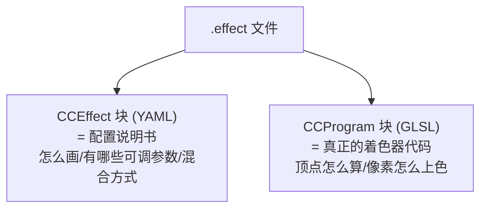
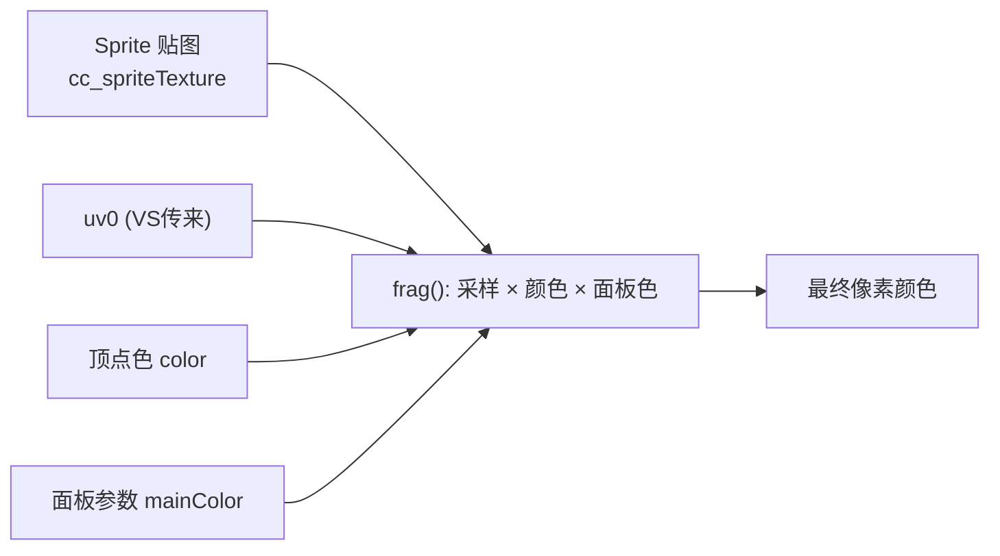
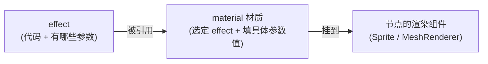

# 第2章 Cocos Effect 体系详解

> 前两章是地基，这一章开始「上手」。学完你就能写出 Cocos 里第一个真正能跑的 Shader。
> 核心任务：搞懂 `.effect` 文件长什么样、每一块是干嘛的。

---

## 一、学习目标

- 理解 `.effect` 文件的「双层结构」：配置(YAML) + 代码(GLSL)
- 读懂 `CCEffect` 里的 techniques / passes / properties / 渲染状态
- 知道怎么把 `properties` 暴露到材质面板上调参
- 会用 Cocos 内置变量（时间、矩阵、贴图）和内置 include
- 拿到一个**最小可运行模板**，作为后面所有章节的脚手架

---

## 二、说人话：`.effect` 文件 = 一份「说明书 + 代码」

一个 Cocos 的 `.effect` 文件，其实是把两样东西打包在一起：



- **CCEffect（YAML）**：像「产品规格表」。告诉引擎：用哪个顶点函数、哪个片元函数，开不开透明混合，材质面板上给用户暴露哪些可调参数。
- **CCProgram（GLSL）**：就是你上一章学的 Shader 代码。

它们靠特殊的包裹语法分隔：

```
CCEffect %{
   ... 这里写 YAML 配置 ...
}%

CCProgram 名字 %{
   ... 这里写 GLSL 代码 ...
}%
```

> 记住 `%{ ... }%` 是 Cocos 的「这一块是特殊内容」的标记，别漏了。

---

## 三、CCEffect 配置块逐字段拆解

来看一段典型的 2D 精灵 effect 的配置部分：

```yaml
CCEffect %{
  techniques:                 # 技术列表（一个 effect 可以有多套渲染方案）
  - name: opaque              # 这套方案叫什么（可省略）
    passes:                   # 一套方案里的若干「渲染通道」
    - vert: sprite-vs:vert    # 用哪个 CCProgram 的哪个函数当顶点着色器
      frag: sprite-fs:frag    # 用哪个 CCProgram 的哪个函数当片元着色器
      depthStencilState:      # 深度/模板测试配置
        depthTest: false      # 2D 不需要深度测试
        depthWrite: false
      blendState:             # 混合（透明）配置
        targets:
        - blend: true                       # 开启混合（要支持半透明）
          blendSrc: src_alpha               # 标准透明混合公式
          blendDst: one_minus_src_alpha
          blendSrcAlpha: src_alpha
          blendDstAlpha: one_minus_src_alpha
      rasterizerState:
        cullMode: none        # 不剔除背面（2D 双面可见）
      properties:             # 暴露到材质面板的可调参数 ↓ 重点
        mainTexture: { value: white }                 # 一张贴图，默认白
        mainColor:   { value: [1, 1, 1, 1], editor: { type: color } } # 一个颜色
}%
```

### 关键字段速记表

| 字段 | 作用 | 大白话 |
| --- | --- | --- |
| `techniques` | 渲染方案列表 | 一个 effect 的「方案集」，通常一个就够 |
| `passes` | 渲染通道列表 | 一个方案可以画好几遍（如先画描边再画本体） |
| `vert` / `frag` | 指定 VS / FS 函数 | 格式 `程序名:函数名` |
| `properties` | 材质面板参数 | **你想让美术/自己在面板上拖滑块调的东西** |
| `blendState` | 混合状态 | 控制透明怎么叠加 |
| `depthStencilState` | 深度/模板 | 3D 常开，2D 常关 |
| `rasterizerState` | 光栅化状态 | 主要是 `cullMode`（剔除正反面） |

### properties 怎么写

`properties` 里每一项就是一个会出现在材质面板上的「旋钮」，effect 里用 `uniform` 接收它：

```yaml
properties:
  # 一个 float，面板显示滑块，范围 0~1
  intensity: { value: 1.0, editor: { slide: true, range: [0, 1], step: 0.01 } }
  # 一个颜色，面板显示取色器
  tintColor: { value: [1, 0, 0, 1], editor: { type: color } }
  # 一张贴图，默认用引擎内置的纯白贴图
  mainTexture: { value: white }
```

> 命名规则：`properties` 里的名字，要和 GLSL 里 `uniform` 的名字对应（结构体里的成员名）。下面模板会示范。

---

## 四、Cocos 内置变量与 include（不用自己造轮子）

第0章说过 MVP 矩阵是引擎自动给的，怎么拿？靠 `#include` 内置代码块。

| include / 内置量 | 给你什么 | 用在哪 |
| --- | --- | --- |
| `#include <builtin/uniforms/cc-global>` | 全局量：`cc_time`（时间）、`cc_matViewProj`（VP矩阵）、相机位置等 | 做动画、变换 |
| `#include <builtin/uniforms/cc-local>` | 本物体的 `cc_matWorld`（模型矩阵） | 顶点世界变换 |
| `cc_time.x` | 游戏运行的总时间（秒） | **做随时间变化的动画，超常用** |
| `cc_cameraPos` | 相机世界坐标 | 3D 光照、视线方向 |

> 这些名字（`cc_` 开头）都是 Cocos 约定的内置变量，include 进来就能直接用，不用自己声明。

---

## 五、最小可运行模板（重要！收藏它）

下面是一个**完整、可直接运行**的 2D 精灵 effect。它做的事很简单：采样贴图 × 一个可调颜色。后面 2D 章节的所有特效，都是在这个骨架上改 `frag` 函数。

> 用法：在 `assets` 里新建一个 Effect 文件，把内容全替换成下面这段；再新建材质绑定它；把材质拖到 Sprite 的 `CustomMaterial`。（详见 [README 第三节](./README.md)）

```glsl
// eff-template.effect —— 2D 精灵最小模板
CCEffect %{
  techniques:
  - passes:
    - vert: sprite-vs:vert      # 顶点着色器入口
      frag: sprite-fs:frag      # 片元着色器入口
      depthStencilState:
        depthTest: false
        depthWrite: false
      blendState:
        targets:
        - blend: true
          blendSrc: src_alpha
          blendDst: one_minus_src_alpha
          blendSrcAlpha: src_alpha
          blendDstAlpha: one_minus_src_alpha
      rasterizerState:
        cullMode: none
      properties:
        # 暴露一个颜色到材质面板，默认白色
        mainColor: { value: [1, 1, 1, 1], editor: { type: color } }
}%

CCProgram sprite-vs %{
  precision highp float;
  #include <builtin/uniforms/cc-global>          // 拿到全局矩阵/时间
  #if USE_LOCAL
    #include <builtin/uniforms/cc-local>         // 拿到模型矩阵 cc_matWorld
  #endif

  // 顶点输入（来自精灵网格）
  in vec3 a_position;   // 顶点位置
  in vec2 a_texCoord;   // UV
  in vec4 a_color;      // 顶点颜色（精灵的 color 属性）

  // 传给片元着色器的数据
  out vec2 uv0;
  out vec4 color;

  vec4 vert () {
    vec4 pos = vec4(a_position, 1.0);
    #if USE_LOCAL
      pos = cc_matWorld * pos;                   // 模型 → 世界
    #endif
    pos = cc_matViewProj * pos;                  // 世界 → 裁剪空间

    uv0 = a_texCoord;                            // UV 传下去
    color = a_color;                             // 顶点色传下去
    return pos;                                  // 返回最终位置
  }
}%

CCProgram sprite-fs %{
  precision highp float;
  #include <builtin/internal/embedded-alpha>     // 处理图集的 alpha
  #include <builtin/internal/alpha-test>         // 提供 ALPHA_TEST 宏

  in vec2 uv0;
  in vec4 color;

  // 精灵贴图：Cocos 2D 约定用 cc_spriteTexture，引擎会自动把 Sprite 的图喂进来
  #pragma builtin(local)
  layout(set = 2, binding = 12) uniform sampler2D cc_spriteTexture;

  // 接收材质面板上的 mainColor 参数
  uniform Constant {
    vec4 mainColor;
  };

  vec4 frag () {
    vec4 o = texture(cc_spriteTexture, uv0);     // 1. 采样贴图颜色
    o *= color;                                  // 2. 乘上顶点色
    o *= mainColor;                              // 3. 乘上面板可调颜色
    ALPHA_TEST(o);                               // 4. alpha 裁剪（透明像素丢弃）
    return o;                                    // 5. 输出最终颜色
  }
}%
```

### 这个模板的数据流



### 逐行讲解 frag 的 5 步

1. `texture(cc_spriteTexture, uv0)`：在贴图的 `uv0` 位置取一个颜色。这是 2D Shader 的命根子。
2. `o *= color`：乘上精灵自身的 color（你在 Sprite 组件改的颜色）。
3. `o *= mainColor`：乘上你在材质面板上调的颜色。颜色相乘 = 染色 / 调暗。
4. `ALPHA_TEST(o)`：把太透明的像素直接丢掉（避免边缘问题）。
5. `return o`：交出这个像素的最终颜色。

> 把这一段跑通、在面板上拖动 `mainColor` 看精灵变色，你就正式入门了。

---

## 六、关于 `uniform Constant { ... }` 写法

你可能注意到面板参数是写在一个 `uniform Constant { ... }` 块里，而不是单独 `uniform vec4 mainColor;`。这是现代图形 API（Vulkan/Metal）要求的「**UBO，统一缓冲块**」写法——把多个 uniform 打包成一个块，效率更高。

```glsl
uniform Constant {     // 块名随意，常用 Constant / MyParams
  vec4 mainColor;      // 对应 properties 里的 mainColor
  float intensity;     // 多个参数就往里加
};
```

> 规则：`properties` 里的参数名，必须能在某个 `uniform` 块里找到同名成员。贴图（sampler2D）是例外，单独声明。

---

## 七、材质(.mtl) 和 effect 的关系



- **effect** 是「类」：定义了能调什么。
- **material** 是「实例」：选一个 effect，再把每个参数填上具体值（这个 mainColor 填红、那个填蓝）。
- 同一个 effect 可以生出无数个材质，各调各的参数。

所以你改 effect 代码 = 改所有用它的材质的行为；你改材质参数 = 只影响这一个材质。

---

## 八、常见坑

1. **`properties` 名字和 `uniform` 对不上**：参数不生效或编译报错。务必同名。
2. **漏了 `%{` 或 `}%`**：整个文件解析失败。
3. **`vert: sprite-vs:vert` 写错程序名/函数名**：找不到入口，报错。
4. **2D 忘了关 depthTest / 开 blend**：透明区域显示成黑块或被错误遮挡。
5. **贴图采样到的是黑的**：检查 Sprite 是否真有图、UV 是否正确传递。
6. **直接写 `uniform vec4 mainColor;` 不放块里**：部分平台会报错，统一用 `uniform Xxx { }` 块。

---

## 九、练习题

1. 把模板里的 `o *= mainColor;` 改成 `o.rgb *= 0.5;`，预测并验证效果（提示：变暗）。
2. 在 `properties` 和 `uniform` 块里加一个 `float brightness`，让最终颜色 `o.rgb *= brightness;`，在面板上拖动看效果。
3. 用 `cc_time.x` 让颜色随时间闪烁：`o.rgb *= abs(sin(cc_time.x));`（记得 FS 里要 include `<builtin/uniforms/cc-global>`）。想一想为什么用 `abs`？
4. 说出 effect、material、节点三者的关系，用自己的话。

---

骨架掌握了，接下来是最有成就感的部分：[第3章 2D 特效实战](./03-2D特效实战.md)，做出描边、溶解、流光这些一看就「哇」的效果！
