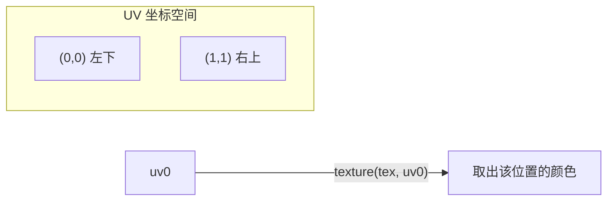
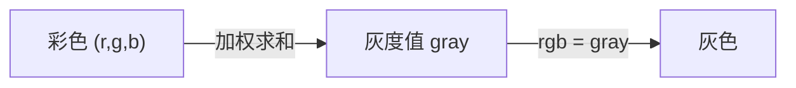
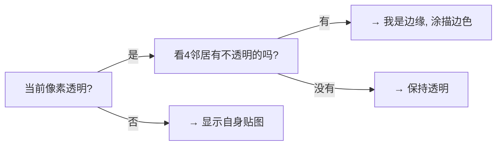
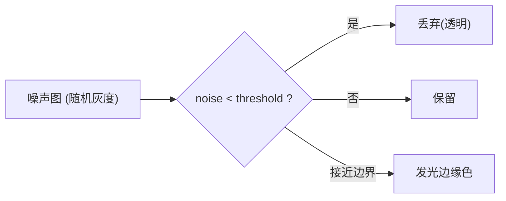
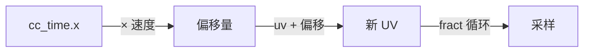
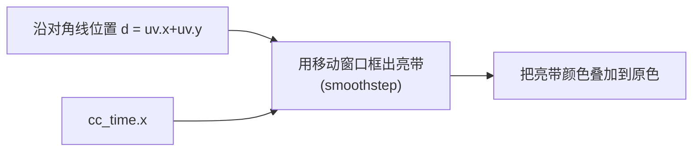
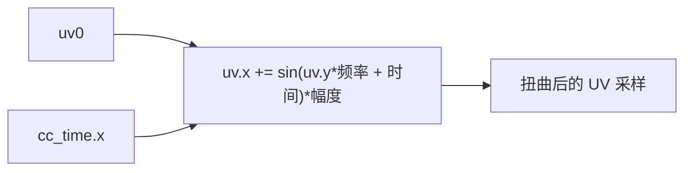
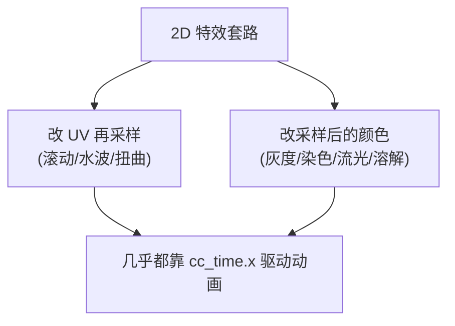

# 第3章 2D / Sprite 特效实战

> 这是最有成就感的一章！我们用第2章的模板做骨架，逐个实现常见 2D 特效。
> 每个特效都遵循：**效果说明 → 原理图 → 代码 → 怎么挂**。

---

## 一、学习目标

- 吃透 UV 与纹理采样这个 2D Shader 的核心
- 独立实现：灰度、染色、描边、溶解、流光、UV 滚动、水波抖动
- 学会「拿到面板参数 → 改 frag → 出效果」的通用套路

---

## 二、先打通任督二脉：UV 与采样



- UV 是贴图坐标，范围通常 `0~1`。`(0,0)` 是一个角，`(1,1)` 是对角。
- `texture(tex, uv)`：到贴图的 uv 位置取颜色。
- **2D 特效的本质** = 对 UV 做手脚（偏移、扭曲、缩放）或对采样出来的颜色做手脚（变灰、染色、叠加）。

> 下面所有 effect 共用第2章模板里的 `sprite-vs`（顶点着色器不变），**我们只改 `properties` 和 `sprite-fs` 的 `frag` 函数**。第一个例子给出完整文件，之后只给「变化的部分」，你套进模板即可。

---

## 三、案例1：灰度（Grayscale）—— 完整示范

### 效果
把彩色精灵变成黑白照片。常用于「禁用状态」「死亡变灰」。

### 原理
人眼对 RGB 敏感度不同，按加权公式把颜色压成一个亮度值，再 rgb 都用它：

```
gray = 0.2126*R + 0.7152*G + 0.0722*B
```



### 完整代码

```glsl
// eff-gray.effect
CCEffect %{
  techniques:
  - passes:
    - vert: sprite-vs:vert
      frag: sprite-fs:frag
      depthStencilState: { depthTest: false, depthWrite: false }
      blendState:
        targets:
        - blend: true
          blendSrc: src_alpha
          blendDst: one_minus_src_alpha
          blendSrcAlpha: src_alpha
          blendDstAlpha: one_minus_src_alpha
      rasterizerState: { cullMode: none }
      properties:
        # 灰度强度：0=原彩色，1=全灰，可做渐变变灰动画
        grayAmount: { value: 1.0, editor: { slide: true, range: [0, 1], step: 0.01 } }
}%

CCProgram sprite-vs %{
  precision highp float;
  #include <builtin/uniforms/cc-global>
  #if USE_LOCAL
    #include <builtin/uniforms/cc-local>
  #endif
  in vec3 a_position;
  in vec2 a_texCoord;
  in vec4 a_color;
  out vec2 uv0;
  out vec4 color;
  vec4 vert () {
    vec4 pos = vec4(a_position, 1.0);
    #if USE_LOCAL
      pos = cc_matWorld * pos;
    #endif
    pos = cc_matViewProj * pos;
    uv0 = a_texCoord;
    color = a_color;
    return pos;
  }
}%

CCProgram sprite-fs %{
  precision highp float;
  #include <builtin/internal/embedded-alpha>
  #include <builtin/internal/alpha-test>
  in vec2 uv0;
  in vec4 color;
  #pragma builtin(local)
  layout(set = 2, binding = 12) uniform sampler2D cc_spriteTexture;
  uniform Constant {
    float grayAmount;          // 对应面板 grayAmount
  };
  vec4 frag () {
    vec4 o = texture(cc_spriteTexture, uv0);
    o *= color;
    // 1. 算灰度值（亮度加权）
    float gray = dot(o.rgb, vec3(0.2126, 0.7152, 0.0722));
    // 2. 在「原彩色」和「全灰」之间按 grayAmount 插值
    o.rgb = mix(o.rgb, vec3(gray), grayAmount);
    ALPHA_TEST(o);
    return o;
  }
}%
```

### 怎么挂
新建 Effect 贴上面代码 → 新建材质绑定它 → 拖到 Sprite 的 `CustomMaterial` → 拖动面板 `grayAmount` 看从彩色到灰的过渡。

> 看懂了吗？`dot` 在这里不是算光照，而是「加权求和」的简便写法。`mix` 实现「可调强度」。这两个第1章的函数立刻就用上了。

---

## 四、案例2：染色 / 色调（Tint）

### 效果
给精灵整体叠加一个颜色，做「受击变红」「中毒变绿」。

### 原理
采样色 × 染色颜色，或在两者间插值。

### 变化部分（套进模板）

```yaml
# properties 里加：
tintColor:    { value: [1, 0, 0, 1], editor: { type: color } } # 染成什么色
tintStrength: { value: 0.5, editor: { slide: true, range: [0, 1], step: 0.01 } }
```

```glsl
uniform Constant {
  vec4 tintColor;
  float tintStrength;
};
vec4 frag () {
  vec4 o = texture(cc_spriteTexture, uv0);
  o *= color;
  // 在原色和「原色乘染色」之间按强度插值
  o.rgb = mix(o.rgb, o.rgb * tintColor.rgb, tintStrength);
  ALPHA_TEST(o);
  return o;
}
```

---

## 五、案例3：描边（Outline）

### 效果
给精灵不透明区域加一圈彩色边。常用于「选中高亮」「卡片边框」。

### 原理（基于 alpha 的简易描边）
看「我自己是透明的，但上下左右某个邻居是不透明的」→ 那我就是边缘，涂描边色。



### 变化部分

```yaml
# properties:
outlineColor: { value: [1, 1, 0, 1], editor: { type: color } } # 描边颜色
outlineWidth: { value: 0.005, editor: { slide: true, range: [0, 0.05], step: 0.001 } } # UV 单位的宽度
```

```glsl
uniform Constant {
  vec4 outlineColor;
  float outlineWidth;
};
// 取某偏移处的 alpha
float sampleAlpha (vec2 uv, vec2 offset) {
  return texture(cc_spriteTexture, uv + offset).a;
}
vec4 frag () {
  vec4 o = texture(cc_spriteTexture, uv0);
  o *= color;
  // 采样上下左右四个方向的 alpha，取最大值
  float a = 0.0;
  a = max(a, sampleAlpha(uv0, vec2( outlineWidth, 0.0)));
  a = max(a, sampleAlpha(uv0, vec2(-outlineWidth, 0.0)));
  a = max(a, sampleAlpha(uv0, vec2(0.0,  outlineWidth)));
  a = max(a, sampleAlpha(uv0, vec2(0.0, -outlineWidth)));
  // 如果自己几乎透明、但邻居不透明 → 是边缘
  if (o.a < 0.1 && a > 0.1) {
    o = outlineColor;
  }
  ALPHA_TEST(o);
  return o;
}
```

> 注意：这种描边要求精灵图四周留有透明边距（否则边缘被裁掉画不出描边）。这是简易版，进阶可做多方向 8 邻域采样更平滑。

---

## 六、案例4：溶解（Dissolve）—— 招牌特效

### 效果
精灵像被火烧 / 数字化一样从一块块消失，边缘还能带发光火边。技能消失、传送都爱用。

### 原理
用一张「噪声图」当作「溶解先后顺序」：噪声值小的地方先消失。用一个随时间增大的阈值 `threshold` 和 `step` 比较，小于阈值的像素丢弃。



### 变化部分

```yaml
# properties:
mainColor:      { value: [1,1,1,1], editor: { type: color } }
noiseTex:       { value: white }    # 噪声贴图（拖一张噪点/柏林噪声图进来）
threshold:      { value: 0.5, editor: { slide: true, range: [0, 1], step: 0.01 } } # 溶解进度
edgeWidth:      { value: 0.1, editor: { slide: true, range: [0, 0.3], step: 0.01 } } # 火边宽度
edgeColor:      { value: [1, 0.5, 0, 1], editor: { type: color } } # 火边颜色
```

```glsl
uniform Constant {
  vec4 mainColor;
  float threshold;
  float edgeWidth;
  vec4 edgeColor;
};
#pragma builtin(local)
layout(set = 2, binding = 12) uniform sampler2D cc_spriteTexture;
// 第二张贴图：噪声图（注意 binding 用不同的号，这里示意，实际以 Cocos 自动分配为准）
uniform sampler2D noiseTex;

vec4 frag () {
  vec4 o = texture(cc_spriteTexture, uv0) * color * mainColor;
  float noise = texture(noiseTex, uv0).r;   // 取噪声灰度
  // 小于阈值的部分溶解掉
  if (noise < threshold) {
    discard;                                 // 直接丢弃该像素
  }
  // 处于边缘区间的像素，叠加火边发光色
  if (noise < threshold + edgeWidth) {
    o.rgb = edgeColor.rgb;
  }
  ALPHA_TEST(o);
  return o;
}
```

> 让它动起来：把 `threshold` 用脚本随时间从 0 调到 1，就是溶解消失动画。也可以在 shader 里用 `cc_time.x` 驱动。
>
> 关于第二张贴图 `noiseTex`：在 Cocos 里给 2D 加额外贴图，最稳妥的做法是把 noise 图也放到一个属性里。如果遇到 binding 冲突，可参考引擎内置多纹理写法或用自定义 set/binding；入门先理解原理，工程化时再调采样槽位。

---

## 七、案例5：UV 滚动（流动）

### 效果
让贴图自己「滚动」，做瀑布、传送带、滚动背景、能量条流动。

### 原理
采样前给 UV 加一个随时间变化的偏移，再用 `fract` 让它循环。



### 变化部分

```glsl
#include <builtin/uniforms/cc-global>   // FS 里也要 include 才能用 cc_time
uniform Constant {
  vec2 scrollSpeed;   // x、y 方向滚动速度
};
vec4 frag () {
  // UV 加上 时间×速度 的偏移，fract 保证在 0~1 循环
  vec2 uv = fract(uv0 + cc_time.x * scrollSpeed);
  vec4 o = texture(cc_spriteTexture, uv) * color;
  ALPHA_TEST(o);
  return o;
}
```

```yaml
# properties:
scrollSpeed: { value: [0.1, 0.0] }   # 默认水平向右滚
```

---

## 八、案例6：流光 / 扫光（Flow Light）

### 效果
一道高光从精灵上斜着扫过，做「卡牌闪光」「按钮高亮」「金属反光」。

### 原理
沿某个方向算一个值（如 `uv.x + uv.y`），用一个随时间移动的窗口（`smoothstep` 做柔边）框出一条亮带，叠加到颜色上。



### 变化部分

```glsl
#include <builtin/uniforms/cc-global>
uniform Constant {
  vec4 shineColor;   // 流光颜色（通常偏白）
  float shineWidth;  // 流光带宽度
  float shineSpeed;  // 移动速度
};
vec4 frag () {
  vec4 o = texture(cc_spriteTexture, uv0) * color;
  // 沿对角线的位置，0~2 之间
  float d = uv0.x + uv0.y;
  // 让亮带中心随时间从 0 移动到 2，用 fract 循环
  float center = fract(cc_time.x * shineSpeed) * 2.0;
  // 距离亮带中心越近越亮（smoothstep 做柔边三角形）
  float band = smoothstep(shineWidth, 0.0, abs(d - center));
  // 叠加流光（只在不透明区域加，乘 o.a）
  o.rgb += shineColor.rgb * band * o.a;
  ALPHA_TEST(o);
  return o;
}
```

```yaml
# properties:
shineColor: { value: [1, 1, 1, 1], editor: { type: color } }
shineWidth: { value: 0.3, editor: { slide: true, range: [0.01, 1], step: 0.01 } }
shineSpeed: { value: 0.5, editor: { slide: true, range: [0, 3], step: 0.01 } }
```

---

## 九、案例7：水波 / 抖动（Wave）

### 效果
精灵像隔着水面 / 热浪一样轻微扭曲晃动。做水下、火焰热浪、果冻效果。

### 原理
采样前，给 UV 叠加一个 `sin` 波动（用 `cc_time.x` 驱动、用另一个坐标轴做相位）。



### 变化部分

```glsl
#include <builtin/uniforms/cc-global>
uniform Constant {
  float waveFreq;   // 波的密度
  float waveAmp;    // 波的幅度
  float waveSpeed;  // 波动速度
};
vec4 frag () {
  vec2 uv = uv0;
  // 让 x 方向随 y 位置和时间做正弦偏移 → 水平晃动
  uv.x += sin(uv0.y * waveFreq + cc_time.x * waveSpeed) * waveAmp;
  vec4 o = texture(cc_spriteTexture, uv) * color;
  ALPHA_TEST(o);
  return o;
}
```

```yaml
# properties:
waveFreq:  { value: 20.0, editor: { slide: true, range: [0, 100], step: 1 } }
waveAmp:   { value: 0.02, editor: { slide: true, range: [0, 0.1], step: 0.001 } }
waveSpeed: { value: 3.0,  editor: { slide: true, range: [0, 10], step: 0.1 } }
```

> 注意幅度别太大，否则会采样到贴图外面出现拉边。让幅度小一点更自然。

---

## 十、套路总结

回头看，这 7 个特效其实只有两类操作：



掌握「对 UV 动手」和「对颜色动手」这两板斧，再加上 `cc_time` 驱动，绝大多数 2D 特效你都能拆解出来。

---

## 十一、常见坑

1. **FS 里用 `cc_time` 忘了 include `<builtin/uniforms/cc-global>`**：编译报错。
2. **UV 偏移太大采样到边界**：出现拉伸的边线，注意控制幅度或设置贴图为重复(repeat)采样。
3. **描边/溶解看不到效果**：检查精灵是否留透明边、噪声图是否真的有明暗变化。
4. **`discard` 滥用**：会影响性能（打断一些 GPU 优化），但做溶解是合理用法。
5. **多贴图 binding 冲突**：2D 加第二张贴图要注意采样槽位，按引擎规则来。

---

## 十二、练习题

1. 把灰度和染色结合：先变灰，再染成单一色调（怀旧老照片效果）。
2. 让溶解的 `threshold` 用 `cc_time.x` 自动从 0 涨到 1 循环（提示：`fract`）。
3. 做一个「呼吸灯」：让精灵亮度随 `sin(cc_time.x)` 平滑明暗变化。
4. 把流光方向从对角线改成纯水平（提示：把 `d = uv0.x + uv0.y` 改成 `d = uv0.x`）。
5. 组合题：做一个「受击效果」——同时闪白 + 轻微抖动，持续一小段时间。

---

2D 玩熟了，我们进入立体世界：[第4章 3D 顶点变换与光照基础](./04-3D顶点变换与光照基础.md)。
