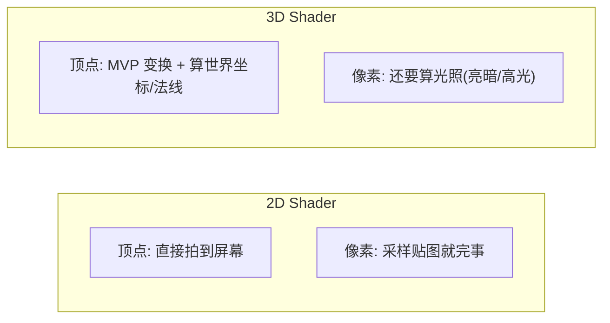
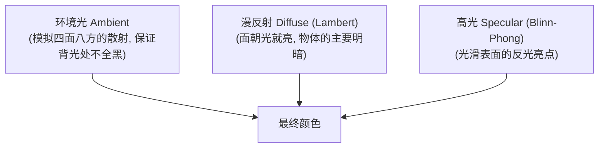
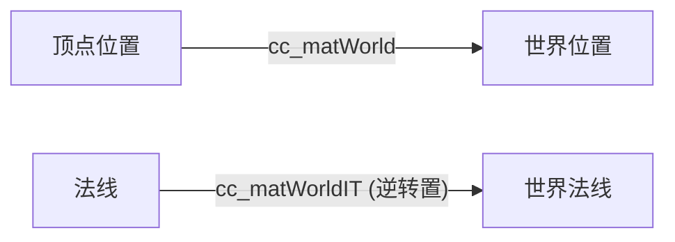
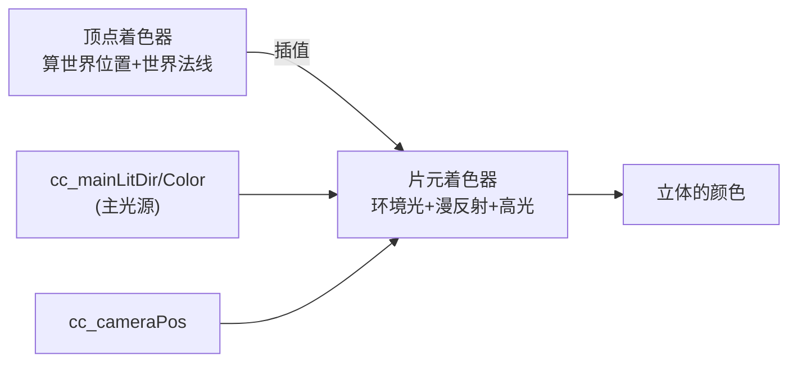
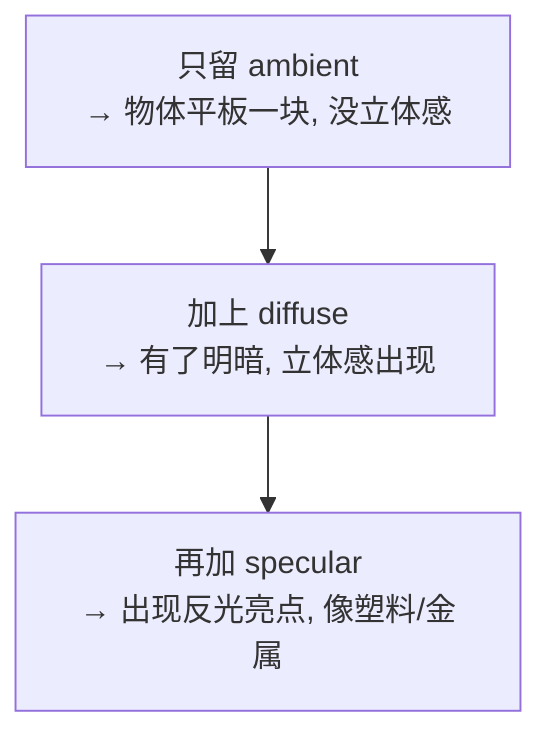

# 第4章 3D 顶点变换与光照基础

> 从 2D 跨到 3D，多了两件大事：**顶点要做 3D 变换**、**像素要算光照**。
> 这一章带你手写一个最基础的 3D 光照 Shader，把光照原理彻底吃透。

---

## 一、学习目标

- 在顶点着色器里完成 MVP 变换，并把世界坐标、世界法线传给片元
- 理解为什么法线要用「特殊矩阵」变换
- 手写三种光照：环境光、Lambert 漫反射、Blinn-Phong 高光
- 学会从 Cocos 内置变量拿主光源信息

---

## 二、说人话：3D 比 2D 多了什么



3D 物体看起来「立体」，靠的就是**光照**——面朝光的地方亮、背光的地方暗。而要算光照，就得知道每个像素所在表面的**朝向（法线）**和**位置**。这两样都得在顶点着色器算好、插值传给片元。

---

## 三、光照三要素

我们要算的「最终颜色」，由三部分相加：



| 成分 | 决定什么 | 核心公式直觉 |
| --- | --- | --- |
| 环境光 | 背光处也不全黑 | 一个常数色 |
| 漫反射 | 物体的基本立体感 | `max(dot(N, L), 0)`，法线越对着光越亮 |
| 高光 | 塑料/金属的反光点 | 视线越接近「反射方向」越亮，用 `pow` 控制亮点大小 |

其中：

- **N** = 法线（表面朝向，单位向量）
- **L** = 指向光源的方向（单位向量）
- **V** = 指向相机的方向（单位向量）
- **H** = L 和 V 的「半程向量」`normalize(L + V)`，Blinn-Phong 的关键

---

## 四、为什么法线要用「特殊矩阵」？

直觉上法线也该和位置一样乘 `cc_matWorld`，但**当物体非等比缩放时，普通矩阵会让法线歪掉**（不再垂直于表面）。所以法线要用「世界矩阵的逆转置矩阵」`cc_matWorldIT`。



> 入门只需记住结论：**位置用 `cc_matWorld`，法线用 `cc_matWorldIT`**。引擎都帮你准备好了。

---

## 五、完整代码：手写 Blinn-Phong 光照

下面是一个**自定义 3D 光照 effect**（不依赖 Surface Shader，纯手写，最适合学原理）。可挂到 3D 模型（如内置 Box / Sphere）的 `MeshRenderer` 上。

```glsl
// eff-blinn-phong.effect
CCEffect %{
  techniques:
  - name: opaque
    passes:
    - vert: lit-vs:vert
      frag: lit-fs:frag
      properties:
        mainColor:     { value: [1, 1, 1, 1], editor: { type: color } }   # 物体固有色
        specColor:     { value: [1, 1, 1, 1], editor: { type: color } }   # 高光颜色
        shininess:     { value: 32.0, editor: { slide: true, range: [1, 256], step: 1 } } # 高光锐度
        ambientColor:  { value: [0.1, 0.1, 0.1, 1], editor: { type: color } } # 环境光
}%

CCProgram lit-vs %{
  precision highp float;
  #include <builtin/uniforms/cc-global>     // cc_matViewProj 等
  #include <builtin/uniforms/cc-local>      // cc_matWorld, cc_matWorldIT

  in vec3 a_position;
  in vec3 a_normal;

  out vec3 v_worldPos;   // 世界坐标（算光照方向用）
  out vec3 v_worldNormal;// 世界法线

  vec4 vert () {
    vec4 worldPos = cc_matWorld * vec4(a_position, 1.0);  // 顶点 → 世界
    v_worldPos = worldPos.xyz;
    // 法线用逆转置矩阵变换，再归一化
    v_worldNormal = normalize((cc_matWorldIT * vec4(a_normal, 0.0)).xyz);
    return cc_matViewProj * worldPos;                     // 世界 → 裁剪
  }
}%

CCProgram lit-fs %{
  precision highp float;
  #include <builtin/uniforms/cc-global>     // cc_cameraPos, cc_mainLitDir, cc_mainLitColor

  in vec3 v_worldPos;
  in vec3 v_worldNormal;

  uniform Constant {
    vec4 mainColor;
    vec4 specColor;
    float shininess;
    vec4 ambientColor;
  };

  vec4 frag () {
    // --- 准备三个关键方向向量（都归一化）---
    vec3 N = normalize(v_worldNormal);                 // 法线
    // cc_mainLitDir 是「光照射出去」的方向，指向光源要取反
    vec3 L = normalize(-cc_mainLitDir.xyz);            // 指向光源
    vec3 V = normalize(cc_cameraPos.xyz - v_worldPos); // 指向相机
    vec3 H = normalize(L + V);                         // 半程向量

    // --- 1. 漫反射 Lambert ---
    float diff = max(dot(N, L), 0.0);                  // 面朝光越正越亮
    vec3 diffuse = diff * cc_mainLitColor.rgb * mainColor.rgb;

    // --- 2. 高光 Blinn-Phong ---
    float spec = pow(max(dot(N, H), 0.0), shininess);  // 视线接近反射方向才亮
    vec3 specular = spec * cc_mainLitColor.rgb * specColor.rgb;

    // --- 3. 环境光 ---
    vec3 ambient = ambientColor.rgb * mainColor.rgb;

    // --- 三者相加 ---
    vec3 finalColor = ambient + diffuse + specular;
    return vec4(finalColor, mainColor.a);
  }
}%
```

### 数据流图



---

## 六、内置光源/相机变量速查

| 变量 | 含义 | 来自 |
| --- | --- | --- |
| `cc_cameraPos` | 相机世界坐标 | `<builtin/uniforms/cc-global>` |
| `cc_mainLitDir` | 主方向光的方向（光射出的方向，用时取负） | cc-global |
| `cc_mainLitColor` | 主方向光颜色 × 强度 | cc-global |
| `cc_matWorld` | 模型矩阵（位置变换） | `<builtin/uniforms/cc-local>` |
| `cc_matWorldIT` | 法线变换矩阵（逆转置） | cc-local |
| `cc_matViewProj` | 视图投影矩阵 | cc-global |

> 在场景里需要有一个「方向光（DirectionalLight）」节点，`cc_mainLitDir/Color` 才有意义。新建 3D 场景默认就带一个。

---

## 七、循序理解：从 Lambert 到 Blinn-Phong

建议你亲手做这个对比实验，最能体会每个成分的作用：



- 把 `diffuse` 和 `specular` 暂时注释掉，只留 `ambient`：物体是纯色平板。
- 加回 `diffuse`：立刻有了「向光面亮、背光面暗」的立体感。这就是 Lambert。
- 加回 `specular`：表面出现一个会随视角移动的高光点。调 `shininess` 看亮点变大变小（值越大越小越锐，越像金属）。

---

## 八、常见坑

1. **法线没归一化**：插值后法线长度会变，必须在 FS 里再 `normalize(N)`。
2. **光方向忘了取负**：`cc_mainLitDir` 是光射出方向，算点乘要用「指向光源」即 `-cc_mainLitDir`。
3. **场景里没方向光**：光照全黑或只剩环境光。
4. **把高光算成漫反射那样**：高光要用 N·H 的高次幂（`pow`），不是直接 dot。
5. **a 通道忘了给**：返回 `vec4`，alpha 别漏。

---

## 九、练习题

1. 注释掉 specular，只保留 ambient + diffuse，观察区别。再调 `ambientColor` 看背光面变化。
2. 把 `shininess` 从 8 调到 200，描述高光点的变化。
3. 把高光颜色 `specColor` 调成红色，漫反射保持白色，会看到什么？（金属质感小实验）
4. 思考：如果不传世界坐标 `v_worldPos`，还能算出指向相机的方向 V 吗？为什么？
5. 进阶：尝试用 `dot(N, L)` 的结果直接作为颜色输出（`return vec4(vec3(diff), 1.0);`），观察纯漫反射的明暗分布。

---

手写光照让你理解了底层，但实际项目里逐个手写太累。下一章看 Cocos 给我们的「半自动」高级工具：[第5章 Surface Shader 与 PBR/卡通](./05-SurfaceShader与PBR卡通.md)。
