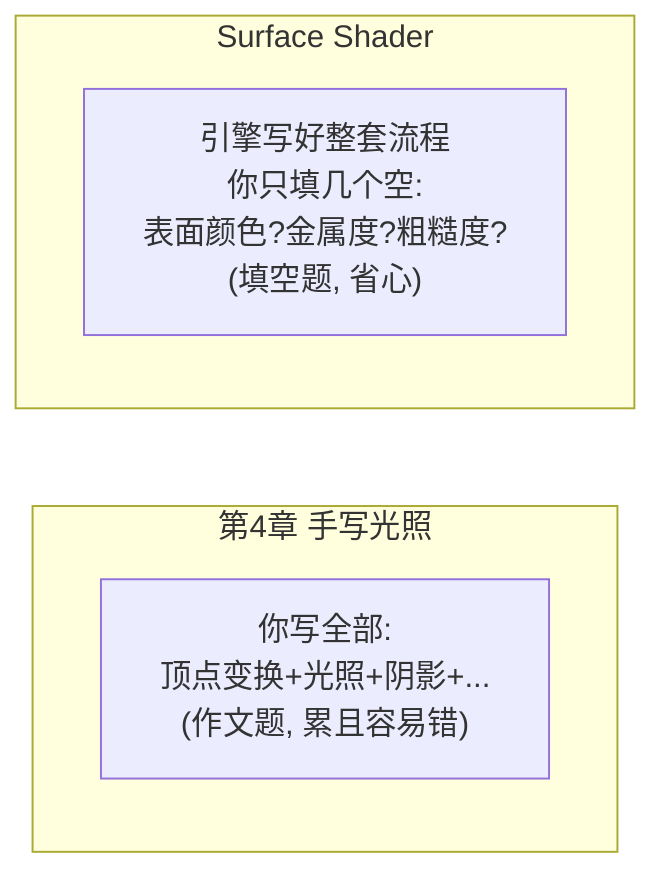
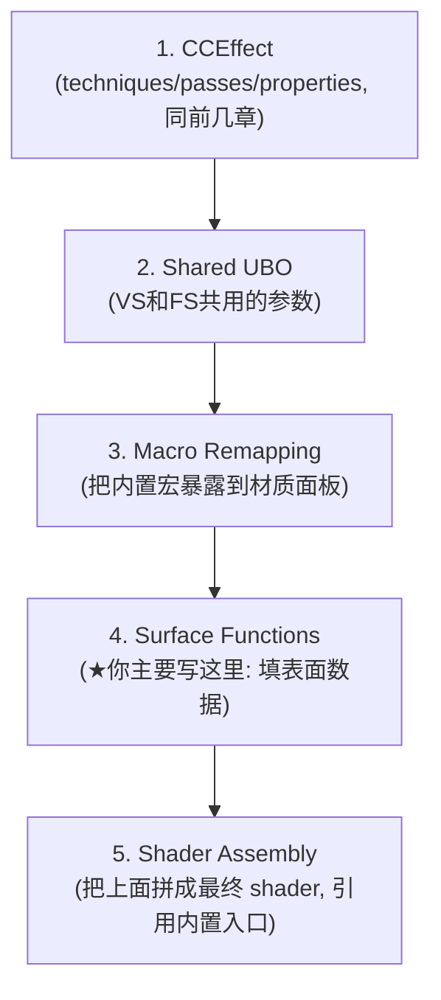
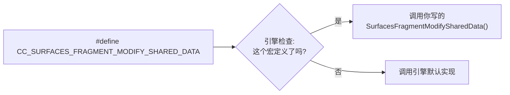
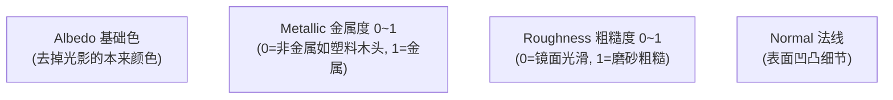
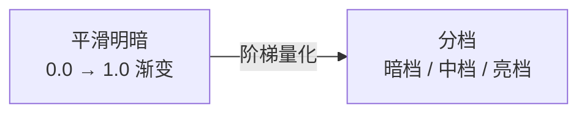
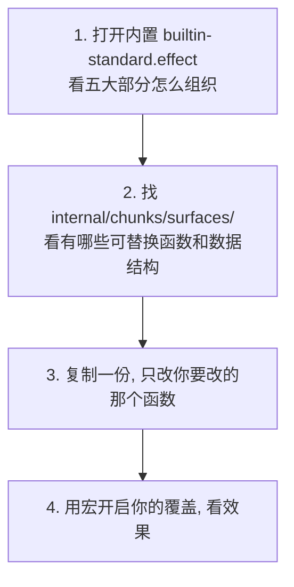

# 第5章 Surface Shader 与 PBR / 卡通渲染

> 第4章手写光照让你懂了原理，但真实项目里光照很复杂（多光源、阴影、PBR、雾……）全手写不现实。
> Cocos 3.8 提供了 **Surface Shader**：你只填「这块表面长啥样」，复杂的光照流程引擎帮你跑。

---

## 一、学习目标

- 理解 Surface Shader 的设计思想：为什么不让你写 main 函数
- 看懂 Surface Shader 的五大组成部分
- 掌握「用宏覆盖内置函数」这个核心机制
- 了解 PBR 的基本参数（金属度 / 粗糙度 / Albedo）
- 用 Surface Shader 做一个卡通渲染（Toon）效果

---

## 二、说人话：Surface Shader 是「填空题」不是「作文题」



核心思想：从 Cocos 3.7.2 起，内置标准材质 `builtin-standard.effect` 就是用 Surface Shader 写的。它把「一个物体怎么被光照亮」的完整流程固化下来，只在关键节点留几个「**可替换函数**」让你插手。

你不需要写 `main`，只需要回答几个问题：

- 这个表面的**基础颜色（Albedo）**是什么？
- 它有多**金属（metallic）**？多**粗糙（roughness）**？
- 法线要不要扰动？（法线贴图）
- （进阶）光照结果要不要二次加工？

引擎负责把你的答案塞进它的光照流水线，算出最终效果。

---

## 三、Surface Shader 的五大组成部分

一个典型的 Surface Shader 由这 5 块拼成（参考官方 `builtin-standard.effect`）：



| 部分 | 干啥 | 你要不要动 |
| --- | --- | --- |
| CCEffect | 老朋友，配置 + properties | 要（加你的参数） |
| Shared UBO | VS/FS 共享的 uniform | 偶尔 |
| Macro Remapping | 让内置开关显示在面板 | 偶尔 |
| **Surface Functions** | **填写表面数据 / 改光照结果** | **主战场** |
| Shader Assembly | `#include` 引擎入口函数组装 | 基本照抄 |

---

## 四、核心机制：用「宏」覆盖内置函数

这是 Surface Shader 最重要的概念。引擎在流水线的关键节点，会调用一些「默认函数」。你想改某一步，**不是去改引擎代码，而是：**

1. 定义一个对应的宏（告诉引擎「这一步我要自己来」）
2. 写一个同名函数（你的实现）

引擎一看到宏被定义了，就会用你的函数替换它的默认版本。



### 常用的可替换函数（记几个高频的）

| 宏 | 对应函数 | 用途 |
| --- | --- | --- |
| `CC_SURFACES_VERTEX_MODIFY_LOCAL_POS` | `SurfacesVertexModifyLocalPos` | 改顶点局部位置（顶点动画、膨胀描边） |
| `CC_SURFACES_VERTEX_MODIFY_WORLD_POS` | `SurfacesVertexModifyWorldPos` | 改世界位置（风吹草动、水面） |
| `CC_SURFACES_FRAGMENT_MODIFY_SHARED_DATA` | `SurfacesFragmentModifySharedData` | **填表面数据：albedo/金属度/粗糙度/法线** |
| `CC_SURFACES_LIGHTING_MODIFY_FINAL_RESULT` | `SurfacesLightingModifyFinalResult` | 改最终光照结果（卡通分级、描边色） |

---

## 五、PBR 概念扫盲（够用就行）

PBR = 基于物理的渲染。它用几个符合直觉的参数描述材质，让物体在任何光照下都「物理正确」：



| 参数 | 0 的时候 | 1 的时候 |
| --- | --- | --- |
| 金属度 Metallic | 塑料、木头、皮肤 | 钢铁、黄金 |
| 粗糙度 Roughness | 镜子、抛光（高光小而亮） | 磨砂、土墙（高光大而散） |

> 直觉：调金属度 + 粗糙度两个滑块，就能在「塑料球」「磨砂金属」「镜面钢球」之间自由切换。这就是 PBR 好用的地方——参数少、符合直觉、效果真实。

实际项目里，你大多数时候**直接用内置 standard 材质，在面板上拖这几个滑块/贴图就够了**，根本不用写 shader。需要写 shader 的是「内置满足不了的特殊效果」，比如下面的卡通渲染。

---

## 六、实战：卡通渲染（Toon Shading）

### 效果
把平滑的光照变成「一块块」的色块（赛璐璐风格），像动漫角色。常配描边一起用。

### 原理
正常漫反射 `dot(N,L)` 是从暗到亮平滑过渡的。卡通把这个连续值「**阶梯化**」成几档：



### 实现思路（基于 Surface Shader 的光照修改）

我们用 `CC_SURFACES_LIGHTING_MODIFY_FINAL_RESULT` 宏，拿到光照结果后把漫反射部分量化。

```glsl
// 在 surface-fragment 的 CCProgram 里加入：
#include <lighting-models/includes/common>
#define CC_SURFACES_LIGHTING_MODIFY_FINAL_RESULT

// 把连续亮度量化成 N 档（卡通分级核心）
float toonQuantize (float value, float steps) {
  // floor 切档 + 归一化回 0~1
  return floor(value * steps) / steps;
}

void SurfacesLightingModifyFinalResult (
    inout LightingResult result,
    in LightingIntermediateData lightingData,
    in SurfacesMaterialData surfaceData,
    in LightingMiscData miscData)
{
  // result.diffuseColorWithLighting 是已经乘了光的漫反射颜色
  // 取它的亮度，量化后重新作用回去，形成色块
  float lum = dot(result.diffuseColorWithLighting, vec3(0.2126, 0.7152, 0.0722));
  float stepped = toonQuantize(lum, 3.0);          // 分 3 档
  // 用量化后的亮度比例缩放原漫反射颜色
  result.diffuseColorWithLighting *= (lum > 0.0 ? stepped / lum : 0.0);
}
```

> 说明：上面的字段名（如 `LightingResult`、`diffuseColorWithLighting`）以你当前引擎版本 `internal/` 里的实际定义为准。Surface Shader 的字段在不同小版本可能微调，**写之前先打开 `internal/chunks/lighting-models/` 和 `internal/effects/builtin-standard.effect` 对照**。这是 Surface Shader 学习的正确姿势：以内置文件为模板。

### 自定义表面数据示例（填 Albedo）

如果只想改「表面长啥样」，用 `CC_SURFACES_FRAGMENT_MODIFY_SHARED_DATA`：

```glsl
#include <surfaces/data-structures/standard>
#define CC_SURFACES_FRAGMENT_MODIFY_SHARED_DATA

void SurfacesFragmentModifySharedData (inout SurfacesMaterialData surfaceData) {
  // 例如：给基础色叠加一个色调，或强制设定金属度/粗糙度
  surfaceData.baseColor.rgb *= vec3(1.0, 0.8, 0.8); // 偏暖
  surfaceData.metallic = 0.0;
  surfaceData.roughness = 0.6;
}
```

---

## 七、描边（3D Outline）的常用做法

3D 卡通描边经典做法是「**法线外扩 + 背面剔除反转**」：把模型沿法线方向「膨胀」一圈，只画背面，形成轮廓线。这要用 `CC_SURFACES_VERTEX_MODIFY_LOCAL_POS` 在一个额外 pass 里把顶点外推：

```glsl
#define CC_SURFACES_VERTEX_MODIFY_LOCAL_POS
vec3 SurfacesVertexModifyLocalPos (in SurfacesStandardVertexIntermediate In) {
  // 沿法线把顶点向外推 outlineWidth 距离
  return In.position.xyz + In.normal * outlineWidth;
}
```

配合在 CCEffect 里加一个 `cullMode: front`（只画背面）的描边 pass。完整描边涉及多 pass 配置，建议直接参考社区的 toon/outline effect 模板起步。

---

## 八、学习 Surface Shader 的正确方法



> 关键心法：**不要从零写 Surface Shader，永远从内置文件改起。** 内置文件路径在引擎安装目录的 `editor/assets` 或项目导入后的 `internal/` 下。

---

## 九、常见坑

1. **想从零手写 Surface Shader**：极难且没必要，一定从内置 effect 复制改。
2. **宏定义了但函数名/签名写错**：覆盖不生效或编译失败，函数签名必须和内置完全一致。
3. **字段名记成别的版本的**：以你当前引擎的 `internal/` 源码为准。
4. **简单需求也硬写 Surface Shader**：很多效果直接用内置 standard 材质拖参数就行。
5. **描边只用一个 pass**：描边通常需要额外 pass，别忘了。

---

## 十、练习题

1. 在场景放一个球，用内置 standard 材质，只拖 metallic 和 roughness 两个滑块，记录「塑料 / 磨砂金属 / 镜面」分别是什么数值组合。
2. 复制内置 standard effect，用 `SurfacesFragmentModifySharedData` 把整个模型染成偏蓝。
3. 把卡通量化的档数从 3 改成 2 和 5，对比色块数量变化。
4. 用自己的话解释「宏覆盖机制」为什么比直接改引擎源码好。
5. 思考：卡通描边为什么要「只画背面 + 法线外扩」就能形成轮廓？

---

3D 材质告一段落。最后一类大特效是作用在整个屏幕上的：[第6章 后处理与全屏特效](./06-后处理与全屏特效.md)。
