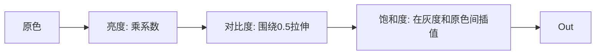
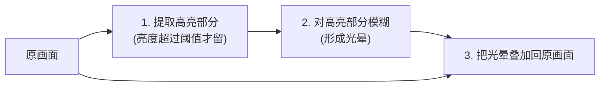
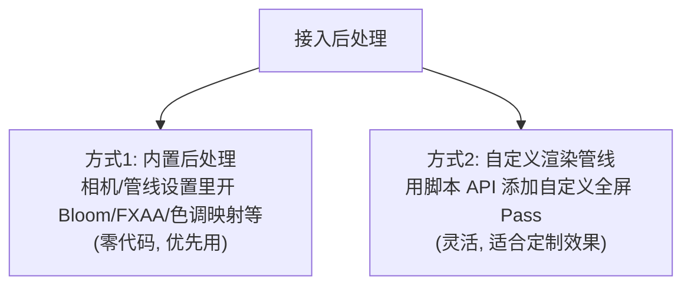

# 第6章 后处理与全屏特效

> 前面的 Shader 都作用在「某个物体」上。后处理（Post-Processing）不一样——它作用在**整张已经画好的画面**上，做调色、模糊、Bloom、扭曲等「电影滤镜」级别的效果。

---

## 一、学习目标

- 理解后处理的原理：把画面当成一张贴图再加工
- 掌握全屏 Pass、Render Texture、屏幕 UV 概念
- 实现：调色（亮度/对比度/饱和度）、模糊、Bloom（简化）、屏幕扭曲
- 了解 Cocos 3.8 自定义渲染管线的接入方式

---

## 二、说人话：后处理 = 给整张照片套滤镜


核心三步：

1. **先把整个场景渲染到一张贴图**（叫 Render Texture，简称 RT），而不是直接画到屏幕。
2. **用一个铺满屏幕的矩形**，把这张 RT 当贴图采样。
3. **在片元着色器里对采样到的颜色加工**（变暗、模糊、提亮高光……），输出到屏幕。

> 所以后处理的片元着色器，输入就是「上一步的画面颜色」，输出就是「加工后的画面颜色」。本质还是「对采样后的颜色动手」，和第3章 2D 特效一脉相承，只不过对象是整个屏幕。

---

## 三、关键概念

| 概念 | 含义 |
| --- | --- |
| 全屏 Pass | 用一个覆盖整个屏幕的四边形（两个三角形）触发一次片元着色器铺满屏幕 |
| Render Texture (RT) | 把渲染结果存进的一张贴图，供后续采样 |
| 屏幕 UV | 范围 0~1 的全屏坐标，`(0,0)` 一角、`(1,1)` 对角，用来采样 RT |
| 采样输入图 | 后处理里通常有个 `inputTexture` / `screenTexture`，就是上一阶段的画面 |


---

## 四、后处理 Shader 的通用骨架（概念版）

不同引擎版本接入后处理的方式不同，但片元着色器的「加工逻辑」是通用的。下面用通用伪代码讲清逻辑，工程接入见第七节。

```glsl
// 后处理片元着色器的通用结构
in vec2 v_uv;                       // 屏幕 UV，全屏 0~1
uniform sampler2D inputTexture;     // 上一阶段的画面
uniform Constant {
  float brightness;
  float contrast;
  float saturation;
};

void main () {
  vec3 color = texture(inputTexture, v_uv).rgb;  // 取原画面颜色
  // ... 这里对 color 做各种加工 ...
  gl_FragColor = vec4(color, 1.0);
}
```

---

## 五、案例1：调色（亮度 / 对比度 / 饱和度）

最常用的后处理，做「白天变黄昏」「受伤画面变灰红」。



```glsl
vec3 color = texture(inputTexture, v_uv).rgb;

// 1. 亮度：直接乘
color *= brightness;

// 2. 对比度：以中灰 0.5 为中心拉伸（>1 增强，<1 减弱）
color = (color - 0.5) * contrast + 0.5;

// 3. 饱和度：在「灰度」和「原色」之间插值
float gray = dot(color, vec3(0.2126, 0.7152, 0.0722));
color = mix(vec3(gray), color, saturation); // saturation=0 全灰, =1 原色, >1 更艳

gl_FragColor = vec4(color, 1.0);
```

这三招，第1章的 `mix` / `dot` 又立功了。看，所有特效翻来覆去就那几个工具。

---

## 六、案例2：模糊（Box / 高斯）

把每个像素和它周围像素「平均」一下，画面就糊了。做背景虚化、弹窗背景。


简化版（Box Blur，等权平均 3x3）：

```glsl
uniform Constant {
  vec2 texelSize;   // 一个像素的 UV 大小 = 1/分辨率
  float blurRadius; // 模糊半径
};
vec3 boxBlur (vec2 uv) {
  vec3 sum = vec3(0.0);
  // 3x3 共 9 个采样点求平均
  for (int x = -1; x <= 1; x++) {
    for (int y = -1; y <= 1; y++) {
      vec2 offset = vec2(float(x), float(y)) * texelSize * blurRadius;
      sum += texture(inputTexture, uv + offset).rgb;
    }
  }
  return sum / 9.0;
}
```

> 高斯模糊就是把「等权平均」换成「中间权重大、边缘权重小」的加权平均，更自然。性能优化上常拆成「先横向模糊、再纵向模糊」两个 pass（叫可分离高斯），把采样次数从 N×N 降到 N+N。

---

## 七、案例3：Bloom（泛光）概念与简化实现

### 效果
亮的地方「溢出」光晕，做霓虹、阳光、魔法光、发光物体。是最出片的后处理。

### 原理（三步）



1. **提亮（阈值过滤）**：只保留够亮的像素，其余变黑。
2. **模糊**：把这些亮点模糊开，形成光晕。
3. **叠加**：模糊后的光晕 + 原图 = 发光效果。

提亮那一步的核心代码：

```glsl
vec3 color = texture(inputTexture, v_uv).rgb;
float lum = dot(color, vec3(0.2126, 0.7152, 0.0722));
// 亮度超过阈值才保留，否则归零
vec3 bright = lum > threshold ? color : vec3(0.0);
```

> Bloom 是多 pass 效果（提亮→模糊→合成），完整实现较复杂。好消息：**Cocos 3.8 内置了 Bloom 后处理**，一般直接在相机/管线设置里开启并调参即可，不必自己写。自己写主要是为了理解原理或做定制。

---

## 八、案例4：屏幕扭曲 / 径向模糊

### 屏幕扭曲（冲击波、水波、眩晕）
对屏幕 UV 做正弦偏移再采样，整张画面就会波动：

```glsl
#include <builtin/uniforms/cc-global>  // 用 cc_time
vec2 uv = v_uv;
uv.x += sin(uv.y * 30.0 + cc_time.x * 5.0) * 0.01; // 水平波动
vec3 color = texture(inputTexture, uv).rgb;
```

### 径向模糊（冲刺、聚焦、爆炸）
朝屏幕中心方向多次采样并平均，形成「向中心冲」的拉丝感：

```glsl
vec2 center = vec2(0.5, 0.5);
vec2 dir = center - v_uv;          // 指向中心的方向
vec3 sum = vec3(0.0);
for (int i = 0; i < 8; i++) {
  float t = float(i) / 8.0 * strength;
  sum += texture(inputTexture, v_uv + dir * t).rgb;
}
vec3 color = sum / 8.0;
```

> 又是熟悉的套路：**改 UV 再采样**（扭曲、径向）vs **改颜色**（调色、Bloom 提亮）。整本教程的特效都逃不出这两类。

---

## 九、在 Cocos 3.8 里接入后处理

Cocos 3.8 有两条路接入全屏后处理：



- **方式1（推荐先用）**：选中 Camera 或在项目渲染设置里，开启内置的后处理（Bloom、色调映射、抗锯齿等），面板拖参数即可，无需写 shader。
- **方式2（定制）**：Cocos 3.8 提供了可编程的自定义渲染管线（Custom Render Pipeline），通过脚本注册自定义的全屏 Pass，把你写的后处理 effect 接进画面渲染流程。这部分 API 较多、版本演进快，建议：
  1. 先用方式1 满足大部分需求；
  2. 需要定制时，查阅官方「自定义渲染管线」最新文档，从官方示例工程改起。

> 入门阶段重点是**理解后处理原理**（本章前八节）。具体的管线 API 接入属于工程化进阶，等原理通了再啃 API 不迟。

---

## 十、常见坑

1. **以为后处理能拿到 3D 几何信息**：默认只有颜色图。要用深度 / 法线得额外输出 G-Buffer。
2. **texelSize 算错**：模糊采样偏移要用 `1/分辨率`，写错会糊得不对。
3. **GPU 循环次数过大**：模糊 / 径向模糊采样次数直接影响性能，移动端要克制。
4. **自己造 Bloom 轮子**：先看内置有没有，多数情况不用自己写。
5. **扭曲采样越界**：UV 偏移过大采到屏幕外，出现拉边。

---

## 十一、练习题

1. 用调色 shader 做一个「中毒效果」：降低饱和度 + 偏绿色调。
2. 把 Box Blur 的 3x3 改成 5x5，对比模糊程度和性能感受。
3. 用自己的话说出 Bloom 的三个步骤，以及每步用到的核心运算。
4. 在场景相机上开启内置 Bloom，放一个高亮自发光物体，观察光晕。
5. 思考：为什么高斯模糊拆成「横 + 竖」两个 pass 比一次 N×N 快很多？

---

最后一章，我们把所有所学串起来：[第7章 综合项目与进阶](./07-综合项目与进阶.md)。
