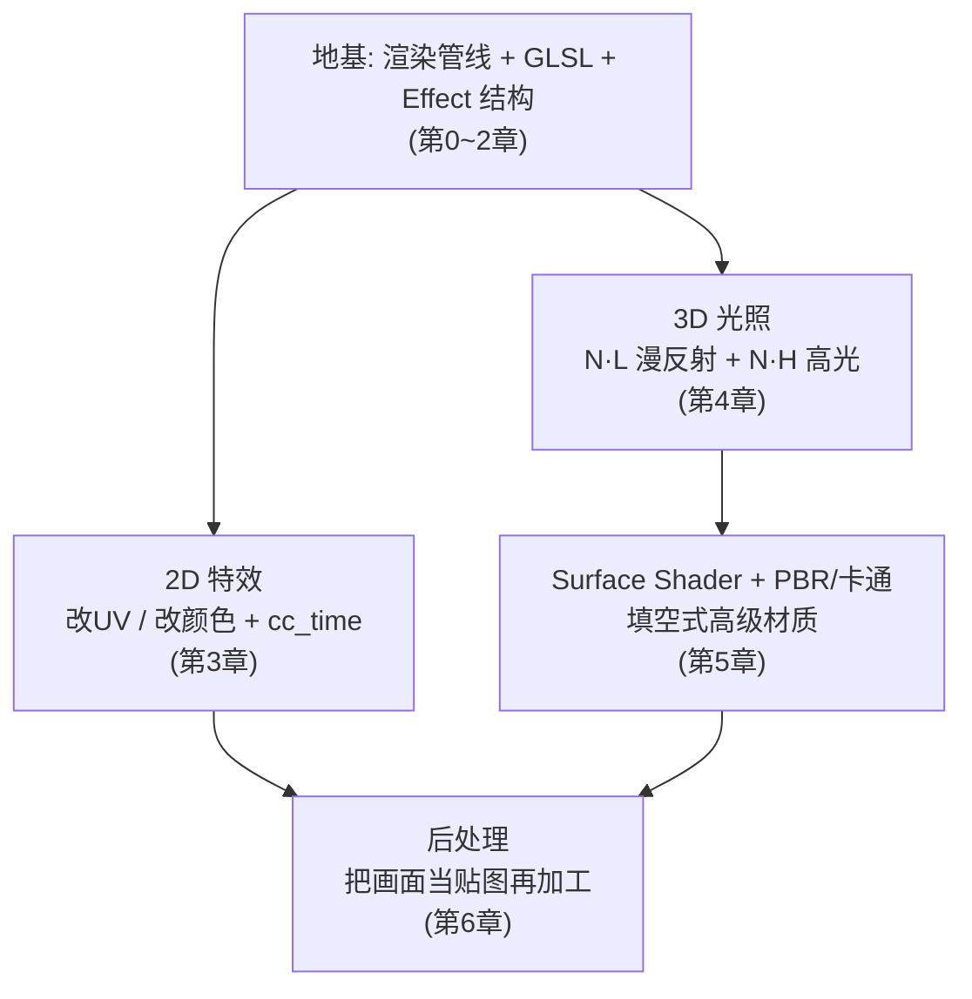
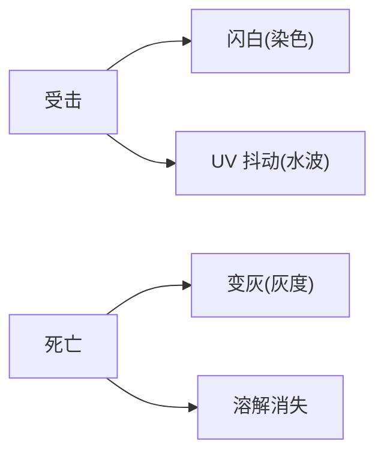
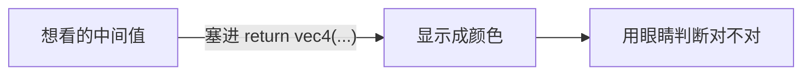
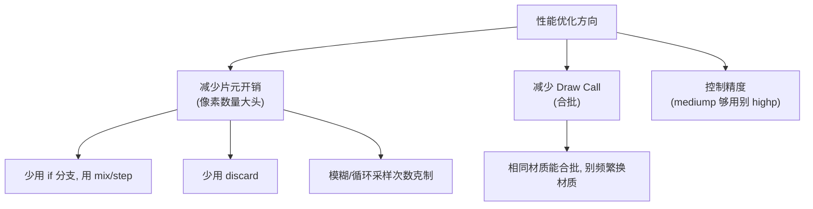
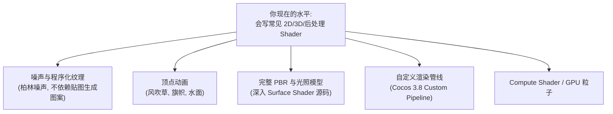

# 第7章 综合项目与进阶

> 学到这里，你已经走完了从「不懂渲染管线」到「能写 2D/3D/后处理 Shader」的全过程。
> 这一章帮你把零散知识串成体系，给出实战项目建议、调试技巧，以及之后该往哪走。

---

## 一、学习目标

- 用一个综合项目把前面所学整合起来
- 掌握 Shader 调试技巧（没有 console 怎么调）
- 知道性能优化和移动端注意点
- 明确进阶方向和优质学习资源

---

## 二、回顾：整本教程的知识地图



**一句话总结整本书**：Shader 无非是「在顶点阶段决定形状、在片元阶段决定颜色」，而决定颜色的手段就两类——**改 UV 再采样**、**改采样后的颜色**，再用 `cc_time`、光照向量、面板参数去驱动它们。

---

## 三、综合项目建议（挑一个做）

### 项目 A：角色受击 / 消失特效（2D，推荐入门综合）

把多个 2D 特效组合到一个角色精灵上：



- 平时：正常显示
- 受击：闪白 + 轻微抖动（第3章染色 + 水波）
- 死亡：变灰 + 溶解消失（第3章灰度 + 溶解）
- 用脚本控制材质参数（`material.setProperty`）随时间变化触发各阶段

### 项目 B：卡通角色材质（3D）

- 用 Surface Shader 做卡通分级光照（第5章）
- 加描边 pass
- 配一个简单的 Bloom 让高光部位发光（第6章内置 Bloom）

### 项目 C：场景氛围（2D + 后处理）

- 背景用 UV 滚动做流动的云 / 水（第3章）
- 关键道具用流光高亮（第3章）
- 全屏加调色 + 暗角 + 轻微径向模糊营造氛围（第6章）

> 建议从**项目 A** 开始，它全部基于你最熟的 2D，且能练到「用脚本驱动 Shader 参数」这个实战必备技能。

---

## 四、用脚本驱动 Shader 参数（实战关键）

Shader 里的 `properties` 不仅能在面板拖，更重要的是能用代码动态改：

```typescript
// 在组件脚本里拿到材质并改参数
import { _decorator, Component, Sprite, Material } from 'cc';
const { ccclass, property } = _decorator;

@ccclass('DissolveController')
export class DissolveController extends Component {
    private _mat: Material | null = null;
    private _time = 0;

    start() {
        // 拿到精灵当前材质实例
        const sprite = this.getComponent(Sprite);
        this._mat = sprite!.getMaterialInstance(0);
    }

    update(dt: number) {
        this._time += dt;
        // 让溶解阈值随时间从 0 涨到 1
        const threshold = Math.min(this._time / 2.0, 1.0);
        // 把值传给 shader 里的 threshold 参数
        this._mat?.setProperty('threshold', threshold);
    }
}
```

> 记住这个套路：`getMaterialInstance` 拿到独立材质实例（避免影响其他对象），再 `setProperty('参数名', 值)`。参数名要和 effect 里 `properties` 的名字一致。

---

## 五、调试技巧：没有 console 怎么调 Shader

GPU 上不能 print，最有效的调试法是「**把数值画成颜色**」：



常用招数：

```glsl
// 看 UV 对不对：红=U，绿=V，应该是个红绿渐变方块
return vec4(uv0, 0.0, 1.0);

// 看法线对不对：把法线 [-1,1] 映射到颜色 [0,1]
return vec4(N * 0.5 + 0.5, 1.0);

// 看某个 float 值的大小：越亮值越大
return vec4(vec3(someValue), 1.0);

// 看某个区域是不是被选中：是就涂红
return isSelected ? vec4(1,0,0,1) : o;
```

其它技巧：

- 编译报错先看引擎控制台 / effect 文件底部的红色提示，**第一行报错最重要**。
- 怀疑某步骤，就临时 `return` 在那一步，逐步往后放。
- 效果全黑/全透明：先 `return vec4(1,0,0,1)` 确认 shader 到底有没有在跑。

---

## 六、性能优化与移动端注意点



移动端尤其注意：

1. **片元着色器是大头**：屏幕像素几百万，FS 里每多一次纹理采样、每个分支都乘以百万倍。
2. **纹理采样次数**：模糊、描边这类多次采样的特效，移动端要降采样或减半径。
3. **精度**：颜色 / UV 用 `mediump` 通常够，省电省热。
4. **避免依赖动态分支**：能用数学函数代替 `if` 就代替。
5. **合批友好**：同一批对象尽量用同一材质，减少 Draw Call。

---

## 七、进阶方向



- **程序化噪声**：学会用代码生成噪声，溶解、云、火、水都更自由。
- **顶点动画**：在 VS 里用 `cc_time` 驱动顶点位置，做动态植被、布料、水。
- **深入 PBR**：读懂 `internal/chunks/lighting-models/`，能改光照模型。
- **自定义渲染管线**：实现复杂的多 pass 后处理、自定义渲染流程。

---

## 八、优质学习资源

| 资源 | 用途 |
| --- | --- |
| Cocos 官方文档 - Shader 章节 | 最权威，Surface Shader / 内置变量以它为准 |
| 引擎内置 `internal/effects/*.effect` | 最好的实战范本，遇事不决看内置 |
| The Book of Shaders（thebookofshaders.com） | 片元着色器 / 噪声 / 数学的神级入门教程 |
| ShaderToy（shadertoy.com） | 海量片元着色器作品，学思路（注意它是纯 FS，迁移到 Cocos 要适配） |
| 《Real-Time Rendering》 | 想深入图形学的圣经（进阶） |

> ShaderToy 迁移小提示：上面的作品大多只有片元着色器、用 `iTime`/`fragCoord`。迁移到 Cocos 时，把 `iTime` 换成 `cc_time.x`、把 `fragCoord/iResolution` 换成你的 UV，再套进 Cocos 的 effect 骨架即可。

---

## 九、学习路线复盘 Checklist

对照检查自己是否真的掌握了（能讲给别人听才算会）：

- [ ] 能画出渲染管线流程，说清 VS / FS 各管什么
- [ ] 看到 `dot(N, L)` 知道它在算什么
- [ ] 能独立写出一个 2D 染色 / 灰度 effect
- [ ] 能解释 attribute / varying / uniform 的区别
- [ ] 能写出 Lambert + Blinn-Phong 光照
- [ ] 知道 Surface Shader 用宏覆盖函数的机制
- [ ] 理解后处理「画面当贴图再加工」的原理
- [ ] 会用脚本 `setProperty` 动态驱动 Shader
- [ ] 会用「输出成颜色」调试 Shader

全部打勾，你就从「Shader 小白」毕业了。剩下的就是多写、多抄、多改——**Shader 是练出来的，不是看出来的**。

---

## 十、最后的话

恭喜你走完这套教程！记住三句话：

1. **遇事不决看内置 effect**，它们是最好的老师。
2. **特效只有两类**：改 UV / 改颜色，别被花样唬住。
3. **动手敲、变成颜色看**，比读十遍文档都管用。

祝你在 Cocos 的 Shader 世界里玩得开心，做出酷炫的效果！

---

[返回总索引](./README.md)
