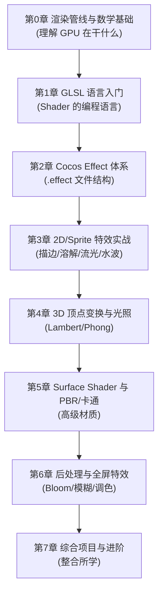
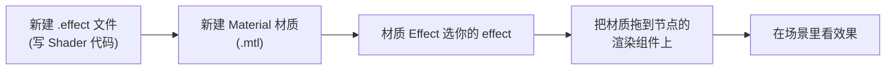

# Cocos Creator 3.8.6 Shader 学习教程（总索引）

> 这是一套为「有编程基础、但零 Shader 经验」的同学量身定做的循序渐进教程。
> 我们的目标：让你不仅会抄 Shader，还能**看懂原理、自己改、自己写**。

---

## 一、这套教程怎么学

每一章都遵循同一个结构，方便你形成肌肉记忆：

1. **学习目标** —— 这一章学完你能做什么
2. **说人话** —— 用生活类比讲清楚核心概念（配 mermaid 图）
3. **理论要点** —— 必须记住的知识点
4. **示例代码** —— 完整、带中文注释、可直接在 Cocos 里运行
5. **常见坑** —— 新手最容易翻车的地方
6. **练习题** —— 动手才能真正掌握

> 建议节奏：每章 1~3 天，**一定要把示例敲进 Cocos 里看效果**，光看不练等于没学。

---

## 二、学习路线图

| 章节 | 文件 | 核心目标 |
| --- | --- | --- |
| 第0章 | [00-渲染管线与数学基础.md](./00-渲染管线与数学基础.md) | 搞懂 GPU 渲染流程和必备数学 |
| 第1章 | [01-GLSL语言入门.md](./01-GLSL语言入门.md) | 会读会写 GLSL 代码 |
| 第2章 | [02-CocosEffect体系详解.md](./02-CocosEffect体系详解.md) | 掌握 `.effect` 文件结构，写出第一个 Shader |
| 第3章 | [03-2D特效实战.md](./03-2D特效实战.md) | 独立实现常见 2D 特效 |
| 第4章 | [04-3D顶点变换与光照基础.md](./04-3D顶点变换与光照基础.md) | 理解 3D 变换与基础光照 |
| 第5章 | [05-SurfaceShader与PBR卡通.md](./05-SurfaceShader与PBR卡通.md) | 用 Surface Shader 做高级材质 |
| 第6章 | [06-后处理与全屏特效.md](./06-后处理与全屏特效.md) | 实现屏幕级特效 |
| 第7章 | [07-综合项目与进阶.md](./07-综合项目与进阶.md) | 整合所学，知道下一步学什么 |

---

## 三、通用操作：在 Cocos 里跑起来一个自定义 Shader

后面所有示例都会用到这套流程，先在这里讲一遍，后续章节不再重复。

### 3.1 2D 精灵（Sprite）用自定义 Shader 的步骤

1. **新建 effect**：在 `assets` 资源面板右键 → `创建` → `着色器(Effect)` → `Surface Shader / Unlit Shader`（2D 一般选无光照的即可），命名如 `eff-gray`。
2. **新建材质**：右键 → `创建` → `材质(Material)`，命名如 `mat-gray`。
3. **绑定 effect**：选中材质，在右侧属性检查器里把 `Effect` 改成你刚建的 `eff-gray`。
4. **挂到精灵**：选中带 `Sprite` 组件的节点，把 `mat-gray` 拖到 `Sprite` 组件的 `CustomMaterial` 字段。
5. 修改 effect 代码并保存，Cocos 会自动热重载，场景里立即看到变化。

### 3.2 3D 模型用自定义 Shader 的步骤

和 2D 类似，只是第 4 步换成：把材质拖到 `MeshRenderer`（网格渲染器）组件的 `Materials` 数组里。

> 小贴士：编辑 `.effect` 用任意文本编辑器（包括 Cursor）都行，保存后 Cocos 自动编译。如果编译报错，编辑器底部 / 控制台会有红色提示，**第一时间看报错信息**。

---

## 四、术语速查表（看到不懂的词回来查）

| 术语 | 大白话解释 |
| --- | --- |
| Shader（着色器） | 跑在 GPU 上、决定「每个像素长啥颜色」的小程序 |
| 渲染管线 | 从 3D 数据到屏幕像素的整条生产流水线 |
| 顶点着色器(VS) | 处理每个「顶点」位置的程序，决定物体在屏幕的形状 |
| 片元着色器(FS) | 处理每个「像素」颜色的程序，决定物体看起来的颜色 |
| 片元(Fragment) | 还没真正画到屏幕、候选状态的「准像素」 |
| 光栅化 | 把三角形拆成一个个像素的过程 |
| 顶点(Vertex) | 模型上的一个点，带位置/UV/法线等数据 |
| UV | 纹理坐标，告诉 GPU「这个点该取贴图的哪个位置」，范围一般 0~1 |
| 法线(Normal) | 表面朝向的方向向量，光照计算的关键 |
| uniform | 由 CPU 传给 GPU、整次绘制都不变的参数（如颜色、时间） |
| varying | VS 算好后插值传给 FS 的数据（如 UV、法线） |
| attribute | 每个顶点自带的输入数据（位置、UV 等） |
| Draw Call | CPU 通知 GPU「画一批东西」的一次命令，越多越费性能 |
| MVP 矩阵 | 模型→世界→视图→投影 的坐标变换矩阵组合 |
| .effect | Cocos 的 Shader 源文件，含配置(YAML)+代码(GLSL) |
| Material(材质) | effect + 一组具体参数值，是真正挂到物体上的东西 |
| CCEffect | `.effect` 里描述渲染配置的 YAML 部分 |
| CCProgram | `.effect` 里写 GLSL 代码的部分 |

---

## 五、环境与版本说明

- 引擎版本：**Cocos Creator 3.8.6**
- Shader 语言：GLSL（Cocos 会自动转译到各平台）
- 本教程所有内置 include、宏、Surface Shader 写法均针对 3.8.x 系列

准备好了就从 [第0章](./00-渲染管线与数学基础.md) 开始吧！
